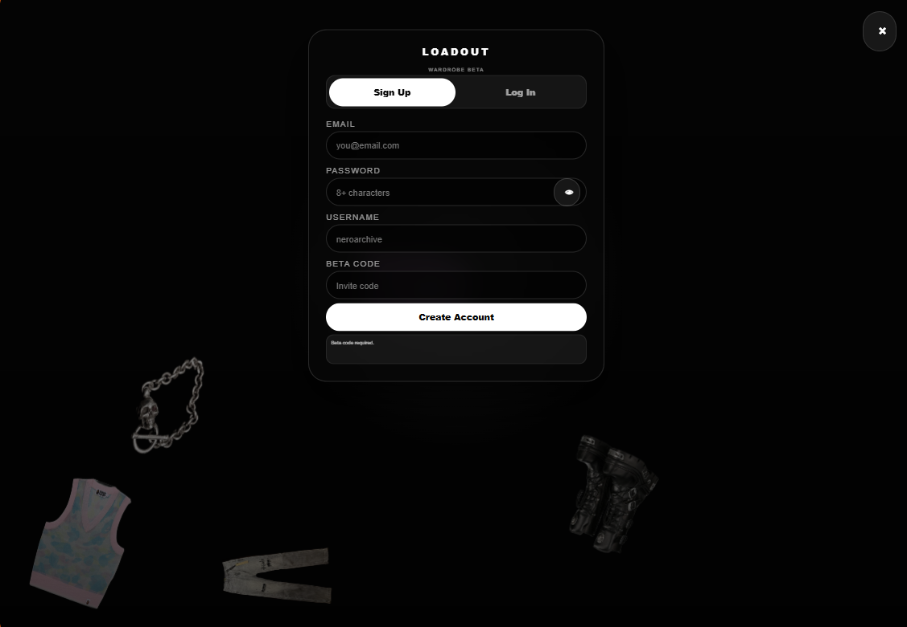
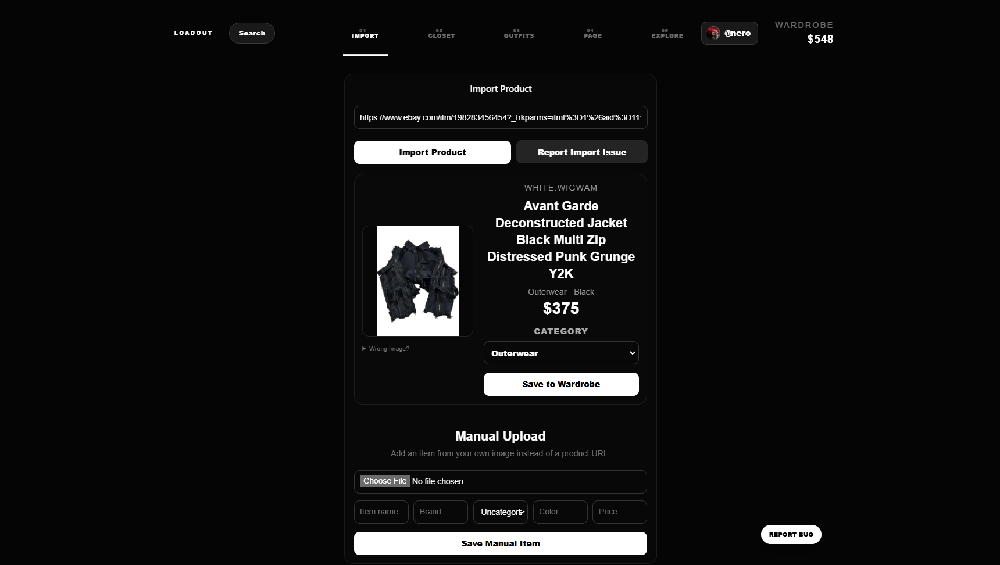
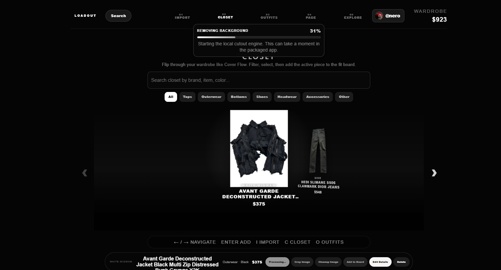
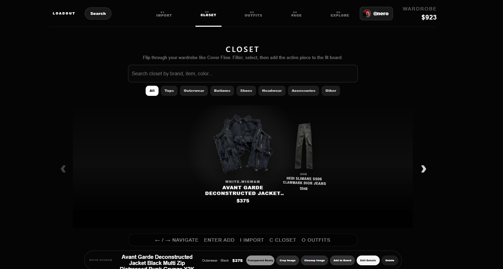
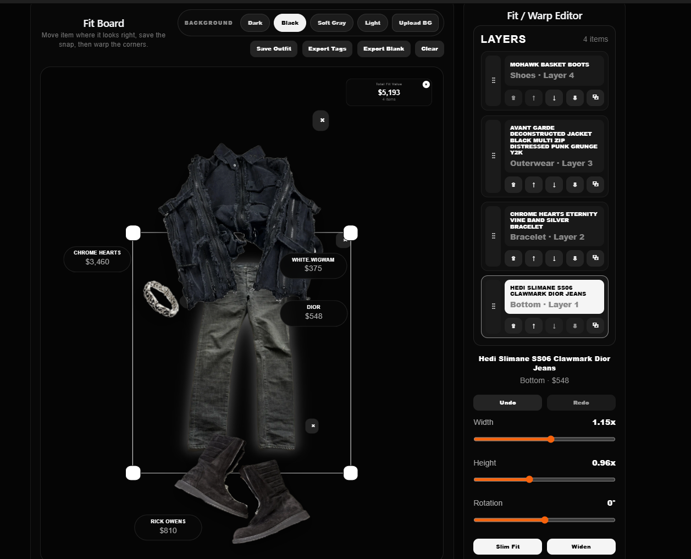
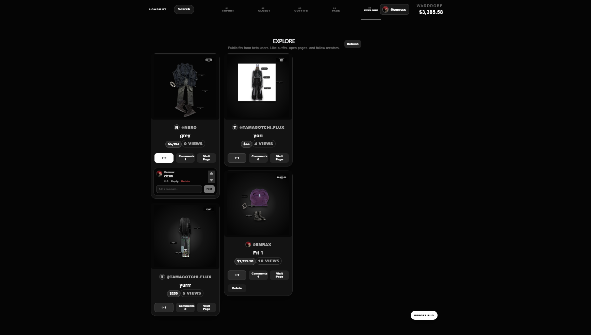
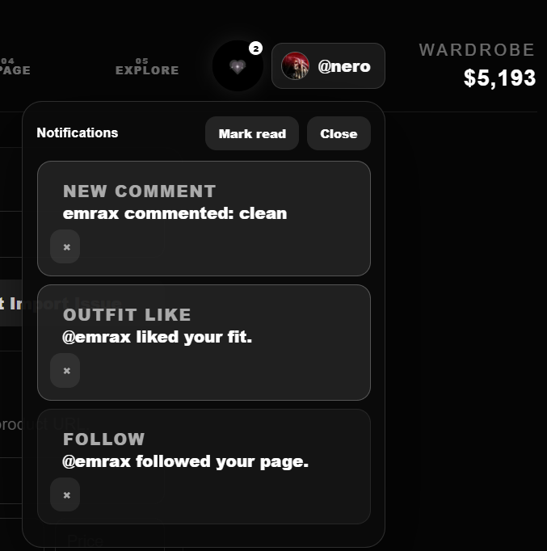

# Loadout Wardrobe

Loadout Wardrobe is a full-stack wardrobe and outfit-building platform designed to help users import clothing items, organize a digital closet, build styled outfits, and share looks through social features.

This repository is a public case study for portfolio and hiring review. The production source code is private.

## Overview

Loadout Wardrobe started as an independent product build focused on turning clothing items into a reusable digital closet and giving users a visual space to create outfits.

The project combines account-based user flows, product importing, image cleanup, background removal, canvas-based outfit arrangement, saved outfits, an Explore page, post interactions, and notifications.

The goal was to build a working product experience, not just a static demo. Loadout Wardrobe includes interactive UI behavior, persistent user-generated content, social engagement features, and desktop app packaging.

## Technical Overview

Loadout Wardrobe was built as a full-stack web and desktop application with:

* Front-end application development
* Database-backed user workflows
* Authentication and user profiles
* Image upload and product import workflows
* Background removal processing
* Canvas-based outfit arrangement
* Saved outfit workflows
* Explore page posting
* Social interaction features
* Notification logic
* Desktop application packaging
* Iterative QA, debugging, and release preparation

Specific production implementation details and source code are private.

## Core Features

* Sign up and login flow
* Animated splash screen with falling clothing physics
* Digital wardrobe for imported clothing items
* Product import flow using item links
* Manual image upload support
* Background removal workflow with loading feedback
* Transparent item images after background removal
* Fit board for arranging clothing items into outfits
* Saved outfits and outfit posting
* Explore page for shared outfits
* User interaction features for posted looks
* Notifications when users interact with posts
* Desktop application packaging and private pre-release deployment

## Screenshots

### Splash Screen

The splash screen displays animated clothing items pulled from the previously signed-in user’s closet, creating a personalized entry experience before login.

### Import Flow

The import screen allows users to paste an item link and import the clothing item into their wardrobe.

### Background Removal Progress

The background removal workflow shows a loading/progress state while the image is being processed.

### Background Removed

After processing, the clothing item is shown without its background so it can be used cleanly on the outfit board.

### Outfit Board

The outfit board is the main styling workspace where users can arrange clothing items into a complete fit. Items can be moved, scaled, rotated, layered, and adjusted with editing controls. The board also includes advanced options such as warp and puppet-style adjustments, allowing clothing pieces to be reshaped and better aligned instead of staying as flat static images.

### Explore Page

The Explore page shows outfits that users have posted publicly for discovery and interaction.

### Notifications

The notification screen shows activity from other users interacting with posted outfits on the Explore page.

## What I Built

* Designed and developed the front-end interface for authentication, importing, wardrobe management, outfit creation, Explore posts, and notifications
* Built account-based workflows for user content and saved wardrobe items
* Developed product import flows that allow users to add clothing items through item links
* Created a background removal workflow with loading feedback and transparent output images
* Built an interactive outfit board for visually arranging clothing into complete looks
* Implemented Explore posting so users can share completed outfits
* Added notification behavior for user interactions on posted outfits
* Managed debugging, UI fixes, release packaging, and product iteration

## Problems Solved

* Turned a manual styling process into a structured digital wardrobe workflow
* Made clothing items reusable by saving them into a digital wardrobe
* Improved outfit creation with a visual board instead of static image storage
* Added background removal to make imported items cleaner and easier to style
* Created social discovery through Explore page posting
* Added notifications so users can see when others interact with their posts
* Improved the product through repeated debugging of imports, image handling, UI layout, search, comments, notifications, and desktop packaging

## Product Highlights

### Animated Entry Experience

The splash screen was designed to make the app feel more polished than a basic login page. The falling clothing animation adds motion and brand personality before users enter the product.

### Import to Wardrobe

Users can import clothing items using links, making it faster to build a digital wardrobe without manually saving every product image first.

### Background Removal

The background removal flow improves outfit creation by turning product images into cleaner transparent assets that can be placed on the fit board.

### Fit Board

The fit board is the main styling workspace. Users can arrange clothing items visually to create a complete outfit before saving or posting it.

### Explore Page

The Explore page turns outfits into shareable posts, making the app more than a private wardrobe tool.

### Notifications

Notifications create feedback when users interact with posted outfits, helping the product feel alive and social.

## Development Focus

This project helped strengthen experience in:

* Full-stack product development
* UI and interaction design
* Authentication-based workflows
* Database-backed user content
* Image import and processing workflows
* Background removal integration
* Interactive outfit-building interfaces
* Social product features
* Notification systems
* Debugging and QA testing
* Desktop app packaging
* Release preparation

## Release Status

The application has been packaged as a private desktop pre-release. Public downloads are not included in this case study repository.

## Status

Private production project. Public case study available for portfolio and hiring review.

Current status:

* Core product features built
* Product import workflow implemented
* Background removal workflow implemented
* Outfit board implemented
* Explore posting implemented
* Notifications implemented
* Desktop pre-release packaged
* Ongoing polish, QA, and feature refinement

## Future Improvements

Planned or potential improvements include:

* Cleaner onboarding flow
* Improved mobile responsiveness
* Better import reliability across retail sites
* More advanced outfit export options
* Improved image editing controls
* Analytics for outfit views and engagement
* Better moderation tools
* Public demo version with sample data

## Note

This repository is a public case study. The production source code is private.
